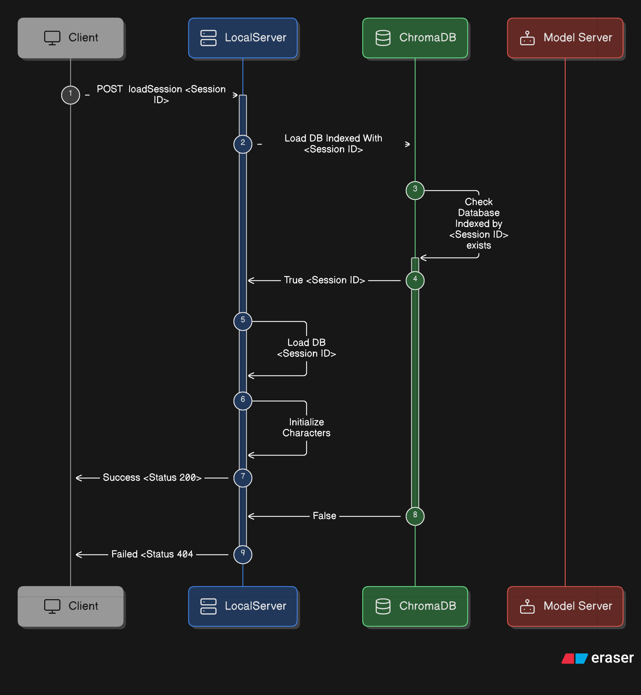
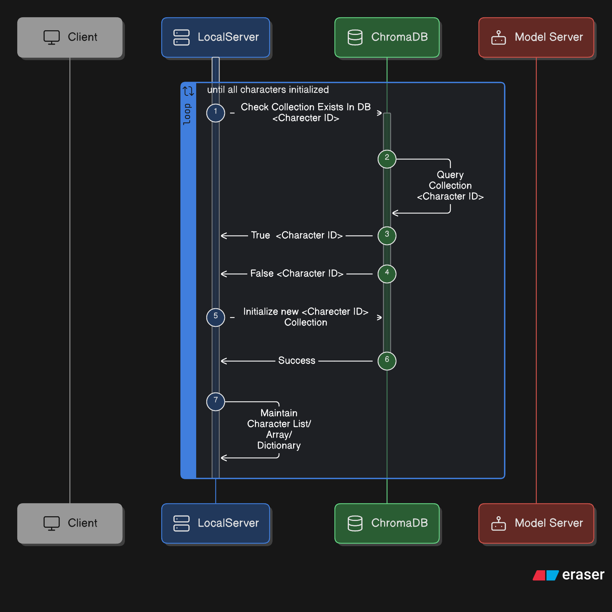
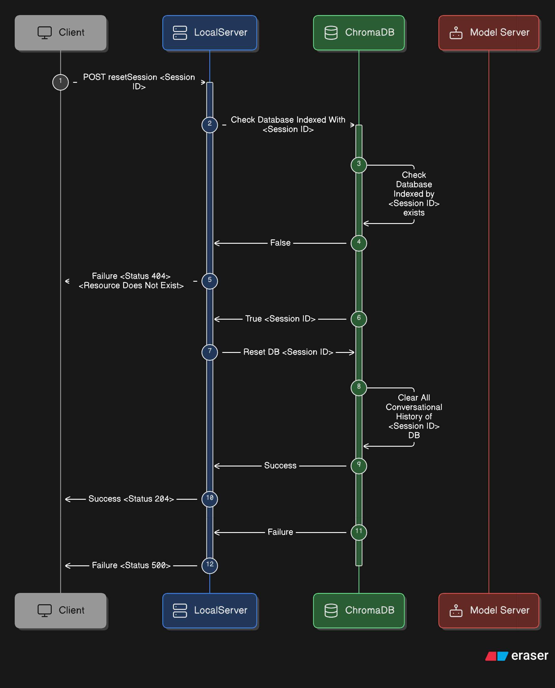
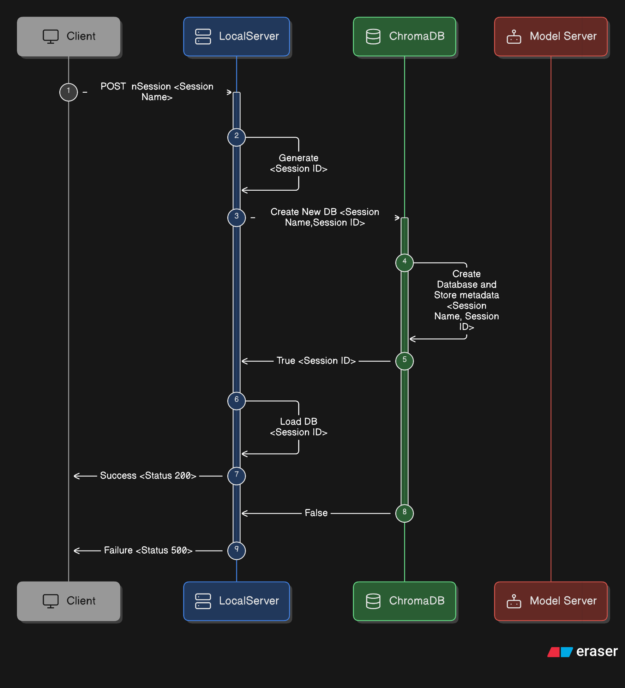
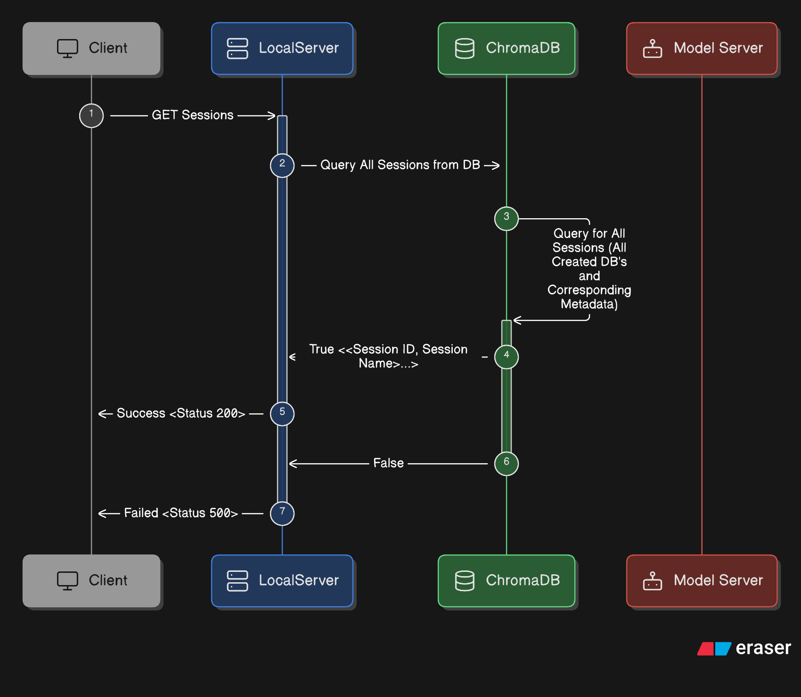
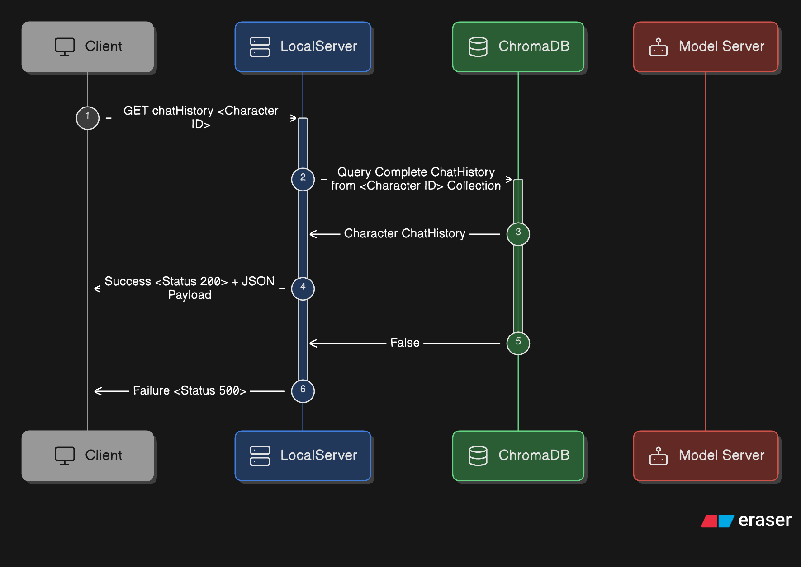
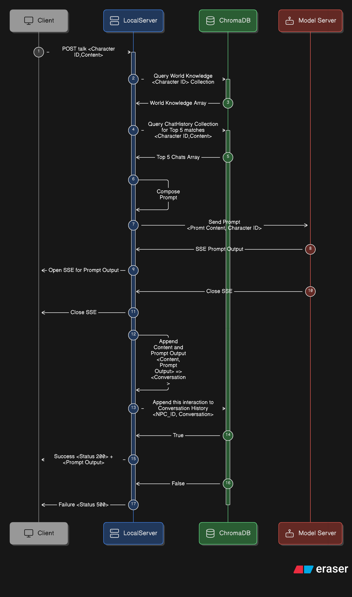

# Backend Endpoints

## Requirements
- Start Flask Server 
- Ideally Load the SLM onto memory for predictions
- 3 Types of Endpoints:
    - HTTP Get Endpoints
    - HTTP Post Endpoints
    - Streamable Endpoint to stream Generated Tokens to frontend from backend  

## Starting Backend
- [ ] Initialize chromaDB database in a persistent directory
- [ ] Register Characters to the DB
    - Read characters.json, see if all ids are present and corresponding db stores are also present
- [ ] Start the server with active endpoints
- [ ] Intialize the slm and its lora adaptors

## Additional Backend Functionalities
- [ ] Define the actual suspect and method to check it
- [ ] Methods to load SLM backend and shift LORA adapters
- [ ] Prompt composer to compose prompt using:
    - Top n elements of conversational history
    - world knowldege
    - current question

## Endpoints

- Endpoint Prefix : `/<GameName>/<Version>/<Episode>`
- POST - `loadSession`
    - Loads Game Session
    - Request
    ```json
        {
          "session_id": "session_001"
        }
    ```
    - Responese
    ```
    Status : 200 => Save File Loaded in Memory
    Status : 404 => Save File Does Not Exist
    ```
    - Sequence Diagram
    
    

- POST - `resetSession`
    - Resets the specific game session by clearing its conversational history in the vector database.
    - Request
    ```JSON
    {
      "session_id": "session_001"
    }
    ```
    - Response Statuses
    ```
    Status : 204 => Success (No Content) - Session history cleared
    Status : 404 => Failure - Session resource does not exist
    Status : 500 => Failure - Internal server error during database reset
    ```
    - Sequence Diagram
    


- POST - `newSession`
    - Creates a fresh game session and initializes the vector database entry.

    - Request
    ```JSON
    {
        "session_name": "New Campaign"
    }
    ```
    - Response
    ```
    Status : 200 => Success - Session created and loaded
    Status : 500 => Failure - Database creation failed
    ```
    - Sequence Diagram
    

- GET - `Sessions`
    - Retrieves a list of all existing sessions and their associated metadata.
    - Response
    ```JSON
    [
      { "session_id": "uuid_1", "name": "Campaign 1" },
      { "session_id": "uuid_2", "name": "Campaign 2" }
    ]
    ```
    - Sequence Diagram
    
- GET - `chatHistory`
    - Fetches the full conversational log for a specific character within the active session.
    - Request
    ```JSON
    {
        "character_id":"char_001"
    }
    ```
    - Response
    ```JSON
    {
        "chats" : ["Hello World","How Are You"]
    }
    ```
    - Response Statuses
    ```
    Status : 200 => Success + JSON History
    Status : 500 => Failure - Query error
    ```
    - Sequence Diagram
    

- POST - `talk`
    - Orchestrates RAG-based conversation with an NPC using Server-Sent Events (SSE) for streaming.
    - Request
    ```JSON
    {
      "character_id": "npc_001",
      "content": "Hello there!"
    }
    ```
    - Response
    ```
        data: Orders
        data: from
        data: the
        data: captain.
        data: [DONE]
    ```

    - Response Statuses
    ```
    Status : 200 => Success + Streaming Response
    Status : 500 => Failure - Interaction failed
    ```
    - Sequence Diagram
    


<!-- - POST - `checkSuspect`
    - Request
    ```json
        {
            "player_id" : "<player id>",
            "player_id": "player_001"
        }
    ```
    - Response
    ```json
        {
            "is_correct_suspect" : <bool>
        }
    ```
- GET - `characters`
    - returns a json object of the form
        ```json
            {
              "character": [
                    {
                      "id" : "<character id>"
                      "name": "<character name>",
                      "lm_type": "<character lm type>"
                    }
                ]
            }


            Example
            {
              "characters": [
                {
                  "id": "guard_01",
                  "name": "City Guard",
                  "lm_type": "TinyLlama"
                },
                {
                  "id": "merchant_01",
                  "name": "Merchant",
                  "lm_type": "TinyLlama"
                }
              ]
            }
        ```

- Stream  - `talk`
    - refer : [Medium Article On Streaming AI Responses Using Flask](https://medium.com/@mr.murga/streaming-ai-responses-with-flask-a-practical-guide-677c15e82cdd)
    - Request 
    ```json
        {
          "player_id": "player_001",<Optional>
          "character_id": "guard_01",
          "message": "Why is the gate closed?"
        }
    ```
    - Stream Response
    - compose prompt
    - switch LoRa adapter before generating 
    - attrib : characterName (as obtained from GET request)
    - SSE is by far easiest -->
